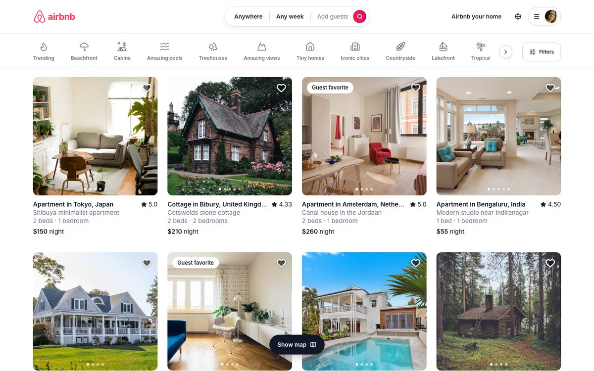
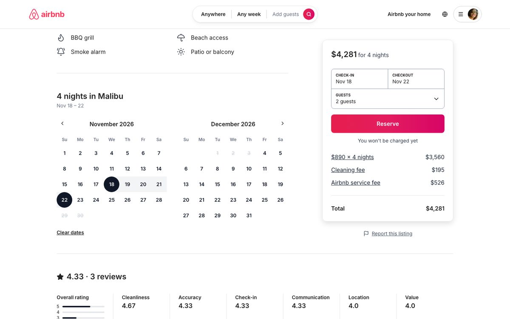
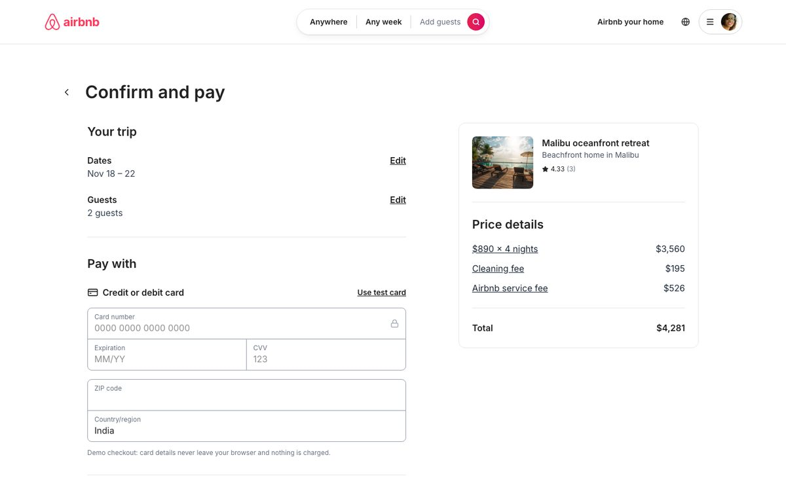
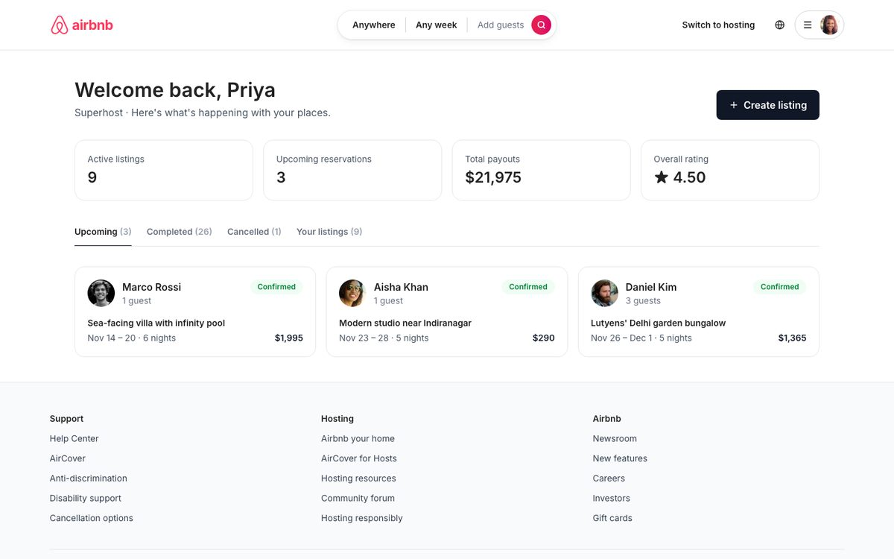
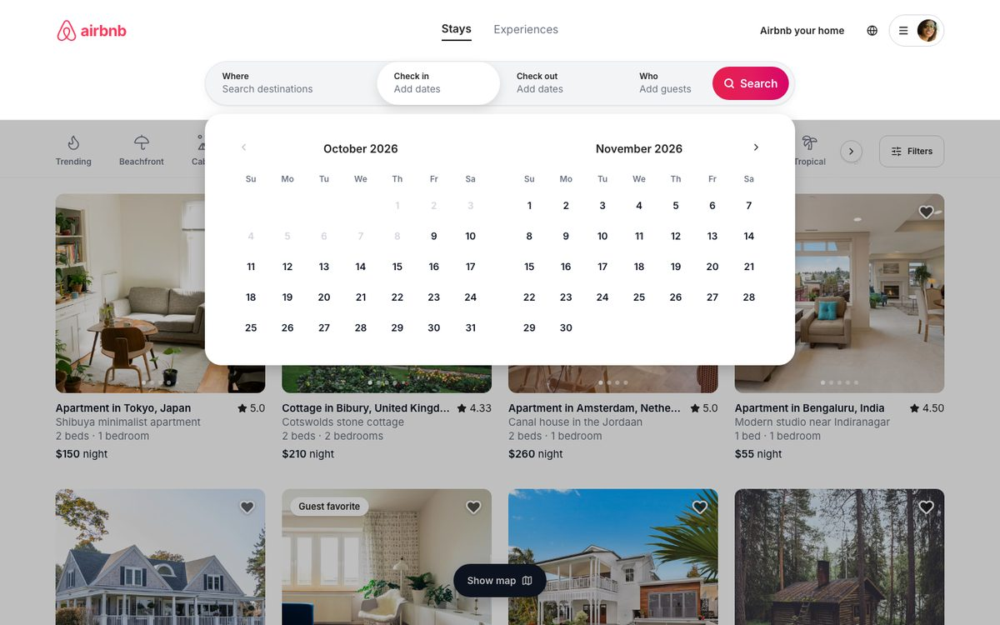
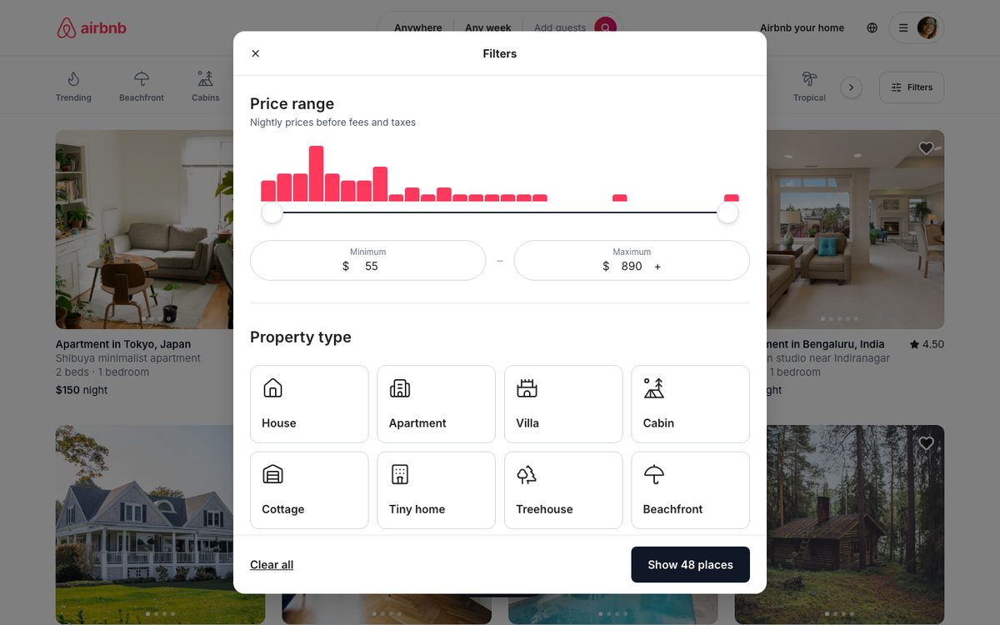
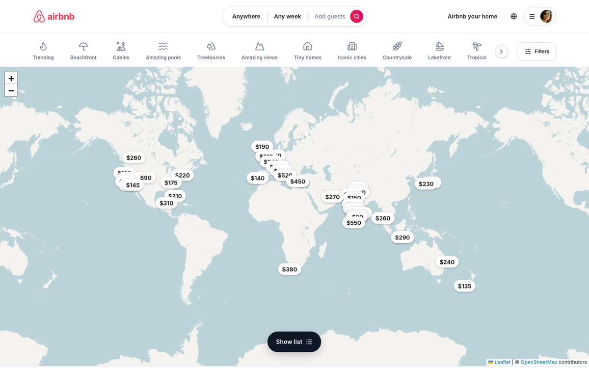
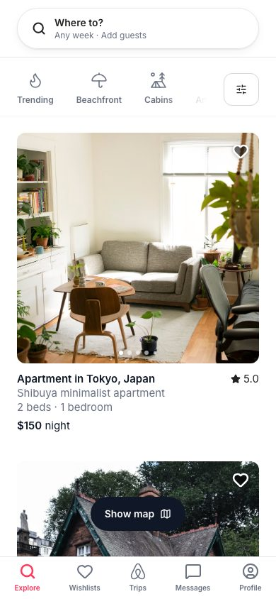
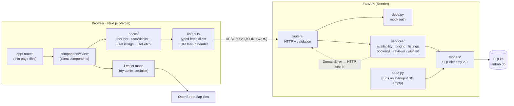
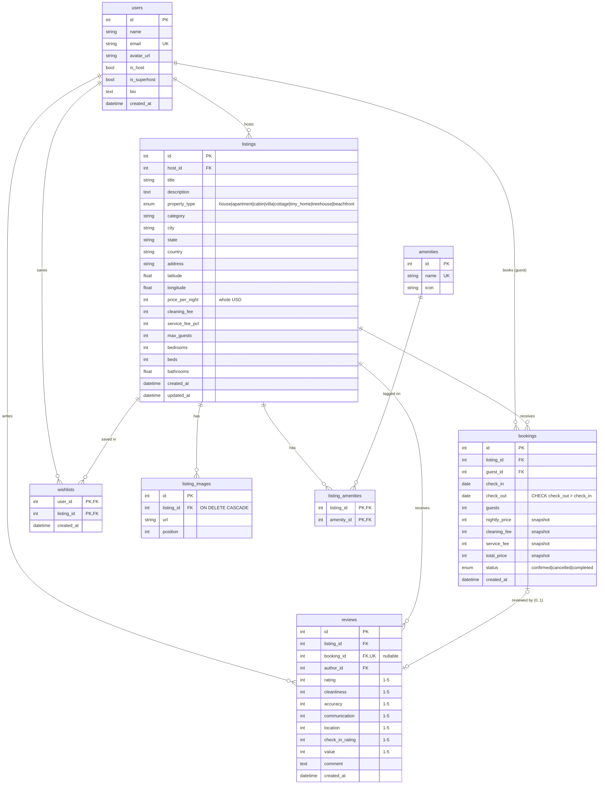

# Airbnb Clone

A full-stack Airbnb clone built as a take-home assignment: search and filter stays, browse listings on a map, book with real availability blocking, manage trips and wishlists, leave reviews, and run a host dashboard with full listing CRUD.

- **Frontend:** Next.js 16 (App Router) + TypeScript + Tailwind CSS 4, in [`frontend/`](frontend)
- **Backend:** FastAPI + SQLAlchemy 2.0 + Pydantic v2 + SQLite, in [`backend/`](backend)



| Listing + booking card | Confirm and pay | Host dashboard |
| --- | --- | --- |
|  |  |  |
| **Search panel** | **Filters** | **Map view** |
|  |  |  |

<p>
  
  
</p>

---

## Contents

- [Quick start](#quick-start)
- [Features](#features)
- [Tech stack](#tech-stack)
- [Architecture](#architecture)
- [Data model](#data-model)
- [API](#api)
- [Key design decisions](#key-design-decisions)
- [Setup (local and deploy)](#setup)
- [Environment variables](#environment-variables)
- [Testing](#testing)
- [Assumptions](#assumptions)
- [Project structure](#project-structure)
- [Known limitations and next steps](#known-limitations-and-next-steps)

---

## Quick start

Requirements: Python 3.10+ and Node 20+.

```bash
make backend    # terminal 1 → API on http://localhost:8000 (docs at /docs)
make frontend   # terminal 2 → web app on http://localhost:3000
```

The first `make backend` creates a virtualenv, installs dependencies and **seeds the database automatically**. Use the avatar menu (top right) to switch between demo users. You start as **Aisha (guest)**; switch to **Priya (Superhost)** to see the host side.

| Demo user | Role |
| --- | --- |
| Priya Sharma | Host · Superhost (India) |
| Marco Rossi | Host · Superhost (Europe) |
| Emily Carter | Host (Americas, Japan, Australia) |
| Arjun Mehta | Host (India, Bali, Maldives, Dubai) |
| Aisha Khan, Daniel Kim, Sofia Martinez | Guests |

**End-to-end flow to try:** search "Goa" with dates → open a listing → Reserve → *Use test card* → Confirm and pay → the trip appears in **Trips** → switch to another guest and the same dates are struck through on the calendar (and blocked server-side with a 409) → switch to the listing's host and the reservation shows under **Host dashboard → Upcoming** → create, edit and delete a listing from the dashboard.

---

## Features

**Explore**
- Airbnb-style header: logo, a compact search pill that expands into a four-segment search bar (**Where / Check in / Check out / Who**) with suggested destinations, a two-month range calendar, and guest steppers (adults, children, infants, pets).
- Right side: "Airbnb your home", a language button, and a user menu (hamburger + avatar) with a **user switcher**, Trips, Wishlists, Messages and Host dashboard.
- Horizontally scrollable **category bar** (Trending, Beachfront, Cabins, Amazing pools, Treehouses…) with an active underline and scroll arrows.
- **Filters modal:** price range slider over a live **price histogram**, property types, bedrooms/beds/bathrooms, amenities, and a live **"Show N places"** count.
- Responsive grid (1 to 6 columns). Cards have an **image carousel** (hover arrows, dots, swipe on touch), a **wishlist heart** with optimistic updates, a "Guest favorite" badge, rating, a dates line (or beds/bedrooms), and nightly price plus stay total when dates are set.
- **Infinite scroll** for the first pages, then a **"Show more"** button, with loading skeletons.
- **Show map** toggle: Leaflet map with **price pins** and popups (`next/dynamic`, `ssr: false`).

**Listing detail**
- Title row with Share (copies the link) and Save.
- **1 large + 4 small photo grid** with a fullscreen "Show all photos" view (a swipeable carousel on mobile).
- Host summary, highlights, description with a "Show more" modal, amenities with a "Show all" modal.
- Inline **two-month availability calendar**: booked nights are disabled and struck through, and a check-out can't extend past the next booking.
- **Sticky booking card:** date and guest pickers, Reserve, "You won't be charged yet", and a server-computed line-item breakdown (`$X x N nights`, cleaning fee, service fee, total).
- **Reviews:** overall distribution bars, six category scores and a review grid with a "Show all" modal.
- **Location map** and a **Meet your host** card with a Superhost badge, stats and bio.

**Booking**
- `/book/[id]` **Confirm and pay**: editable trip details (dates and guests), a mocked card form with format validation and a "Use test card" shortcut, cancellation policy, and a price summary.
- Invalid or overlapping dates show an **inline error plus a toast**. They're checked client-side first, and the server rejects conflicts with **409**.
- A **confirmation page** with a confirmation code and the snapshotted price breakdown.

**Trips, wishlists, reviews**
- **My Trips** with Upcoming, Past and Cancelled tabs. You can **cancel** future stays (confirmed in a modal) and **leave a review** (overall plus six category stars) on completed stays.
- **Wishlists** page.

**Host**
- Dashboard with stats (active listings, upcoming reservations, payouts, rating), incoming reservations (upcoming, completed, cancelled), and a listings table with **View, Edit and Delete**.
- A **multi-step create-listing flow** (Basics → Location → Amenities → Photos (by URL) → Price → Review) with per-step validation, a click-to-place map pin plus "Find address on map" geocoding, and photo reordering. The same flow is reused for editing.

**General**
- Toasts (sonner) for every mutation, and "Coming soon" placeholders for Messages and identity verification.
- Responsive, with an **Airbnb-app-style bottom tab bar on mobile** and a mobile search sheet. Accessible labels, roles, focus handling and Escape-to-close on modals and menus. No console errors in production.

---

## Tech stack

| Layer | Choice | Notes |
| --- | --- | --- |
| Web | Next.js 16 App Router, React 19, TypeScript | Cache Components on; data-driven pages are client components inside `<Suspense>` |
| Styling | Tailwind CSS 4, Inter, lucide-react icons | Brand color `#FF385C`, theme tokens in `app/globals.css` |
| Maps | Leaflet + react-leaflet, OpenStreetMap tiles | Loaded with `next/dynamic({ ssr: false })` |
| Dates | date-fns | A custom Airbnb-style range calendar (`components/ui/RangeCalendar.tsx`) |
| Toasts | sonner | |
| API | FastAPI, Pydantic v2 | Typed request/response models, OpenAPI docs at `/docs` |
| ORM / DB | SQLAlchemy 2.0 (typed `Mapped[]`), SQLite | FKs enforced via `PRAGMA foreign_keys=ON`, WAL mode |
| Tests | pytest + FastAPI `TestClient` | 22 tests for overlap detection, pricing and booking rules |
| Deploy | Render (API) + Vercel (web) | `render.yaml`, `frontend/vercel.json` |

---

## Architecture



- **Routers are thin.** They parse the request, resolve the current user and call a service.
- **Services hold the business logic** (availability, overlap checks, pricing, ownership rules). They raise `DomainError` subclasses (`BadRequest`, `Forbidden`, `NotFound`, `Conflict`), which one exception handler in `main.py` maps to 400/403/404/409. Services never import FastAPI, which keeps them unit-testable.
- **The frontend's pages are thin.** Each `app/**/page.tsx` renders one view component from `components/`. All HTTP goes through `lib/api.ts` (typed with `types/index.ts`).

---

## Data model



| Table | Purpose | Notable constraints and indexes |
| --- | --- | --- |
| `users` | Guests and hosts (one table; `is_host` / `is_superhost` flags). | `email` UNIQUE |
| `listings` | A place to stay. Money is stored as **integer whole USD**. | FK `host_id`; CHECKs: price > 0, fees ≥ 0, service % 0-30, max_guests ≥ 1, rooms ≥ 0; indexes on `host_id`, `property_type`, `category`, `city`, `country`, `price_per_night` |
| `listing_images` | Ordered photo URLs. | FK ON DELETE CASCADE, index on `listing_id` |
| `amenities` / `listing_amenities` | Many-to-many amenity tags. | `name` UNIQUE; **composite PK** (`listing_id`, `amenity_id`) |
| `bookings` | A reservation with a **price snapshot**. | `CHECK (check_out > check_in)`, `CHECK (guests >= 1)`, **composite index (`listing_id`, `check_in`, `check_out`)** for overlap queries, index on `status`, `guest_id` |
| `reviews` | Overall plus six category scores, optionally linked 1:1 to a stay. | `booking_id` UNIQUE (one review per stay) and nullable; CHECK 1-5 on every score |
| `wishlists` | Saved listings per user. | **Composite PK** (`user_id`, `listing_id`) makes saving idempotent |

Ratings are **never stored** on the listing. Average and count are computed with an aggregate (`AVG`/`COUNT … GROUP BY listing_id`) joined as a subquery into list queries, and per-category averages plus a 1-5 distribution are computed for the detail page.

---

## API

All endpoints are under `/api`. Interactive docs: `http://localhost:8000/docs`.
Auth is mocked: send `X-User-Id: <id>` (see [Mock auth](#mock-auth)). 🔒 = requires the header.

| Method | Path | Description | Success | Errors |
| --- | --- | --- | --- | --- |
| GET | `/users` | Seeded accounts for the user switcher | 200 | |
| GET | `/users/me` 🔒 | Current user | 200 | 401 |
| GET | `/listings` | Search. Query: `location, check_in, check_out, guests, min_price, max_price, property_type` (CSV), `category, amenities` (CSV ids, must have **all**), `min_bedrooms, min_beds, min_bathrooms, page, page_size` (≤ 48). Returns `{items, total, page, page_size, pages}` | 200 | 400, 422 |
| GET | `/listings/price-histogram` | Price buckets for the filters modal (same filters, price ignored) | 200 | |
| GET | `/listings/{id}` | Detail: images, amenities, host profile + stats, rating aggregates | 200 | 404 |
| GET | `/listings/{id}/availability` | Booked `[check_in, check_out)` ranges from today | 200 | 404 |
| GET | `/listings/{id}/quote?check_in&check_out` | Server-side price breakdown | 200 | 400, 404 |
| GET | `/listings/{id}/reviews` | Reviews with authors, newest first | 200 | 404 |
| POST | `/listings` 🔒 | Create (hosts only) | 201 | 400, 401, 403, 422 |
| PUT | `/listings/{id}` 🔒 | Replace (owner only) | 200 | 400, 401, 403, 404, 422 |
| DELETE | `/listings/{id}` 🔒 | Delete (owner only; blocked if upcoming reservations) | 204 | 401, 403, 404, 409 |
| POST | `/bookings` 🔒 | Book: validates dates, guests ≤ max, not own listing, no overlap; prices server-side | 201 | 400, 401, 403, 404, **409**, 422 |
| GET | `/bookings/me` 🔒 | My Trips (with `can_cancel`, `can_review`, `has_review`) | 200 | 401 |
| GET | `/bookings/{id}` 🔒 | One booking (guest or listing host) | 200 | 401, 403, 404 |
| PATCH | `/bookings/{id}/cancel` 🔒 | Cancel a future stay (guest or host) | 200 | 400, 401, 403, 404 |
| GET | `/host/listings` 🔒 | Host's own listings | 200 | 401, 403 |
| GET | `/host/bookings` 🔒 | Reservations on the host's listings | 200 | 401, 403 |
| POST | `/reviews` 🔒 | Review a **completed** stay you made (once) | 201 | 400, 401, 403, 404, 409, 422 |
| GET | `/wishlist` 🔒 | Saved listings | 200 | 401 |
| POST | `/wishlist/{listing_id}` 🔒 | Save (idempotent) | 201 | 401, 404 |
| DELETE | `/wishlist/{listing_id}` 🔒 | Unsave (idempotent) | 204 | 401 |
| GET | `/amenities` | All amenities | 200 | |
| GET | `/categories` | Category bar entries (`slug`, `label`, `icon`) | 200 | |
| GET | `/health` | Health check (used by Render) | 200 | |

Errors are always `{"detail": "..."}` (or FastAPI's validation list for 422).

---

## Key design decisions

### Overlap detection (half-open intervals)

A stay occupies the nights `[check_in, check_out)`: the check-out day itself is free. Two stays overlap **iff each starts before the other ends**:

```python
a_start < b_end and b_start < a_end
```

This one rule covers partial overlaps on either side, containment and identical ranges, and it allows **back-to-back stays** (one guest checks out the day the next checks in). It lives in `services/availability.py` twice: as `ranges_overlap()` for unit tests and as `overlap_clause()`, the same predicate as SQL, so the database does the filtering:

- **Booking:** `POST /bookings` runs `EXISTS(bookings WHERE listing_id = ? AND status IN (confirmed, completed) AND check_in < :check_out AND check_out > :check_in)` and returns **409 Conflict** on a hit. Cancelled bookings don't block dates.
- **Search:** with dates, `/listings` excludes `listing_id NOT IN (SELECT listing_id FROM bookings WHERE <overlap>)`. The composite index `(listing_id, check_in, check_out)` serves both queries.
- **Race safety:** SQLite has a single writer, but check-then-insert is two statements, so booking creation is serialised with a process-level lock. With Postgres I'd use an exclusion constraint (`EXCLUDE USING gist (listing_id WITH =, daterange(check_in, check_out) WITH &&)`) so the database itself guarantees no overlaps across instances.
- **UI:** the calendar applies the same rule. Booked nights are struck through, and while you pick a check-out, dates past the next booking's check-in are disabled. The checkout page re-validates and refreshes availability after a 409.

### Price calculation and snapshotting

- Money is **integer whole USD** end to end. There are no floats, so no `0.1 + 0.2` drift.
- `services/pricing.py → calculate_price()` is the single source of truth: `subtotal = nightly × nights`, `service_fee = round_half_up((subtotal + cleaning_fee) × pct / 100)` using integer math, and `total = subtotal + cleaning + service`. The frontend never computes prices; it calls `/listings/{id}/quote`.
- When a booking is created, `nightly_price`, `cleaning_fee`, `service_fee` and `total_price` are **copied onto the booking row**. If a host later changes the price, existing reservations, trip history and payouts don't change. The confirmation page renders the breakdown from the snapshot, not from the listing.

### Mock auth

There are no passwords or sessions. The client sends `X-User-Id`, `deps.get_current_user` loads that user (401 if missing or unknown), and `GET /api/users` powers the user switcher in the avatar menu (the choice is remembered in `localStorage`). Authorization is still enforced server-side: hosts-only listing CRUD (403), owner checks on edit/delete (403), no booking your own listing (403), cancel only your own or your listing's bookings, and review only your own completed stays. Swapping in real auth (e.g. JWT) means replacing one dependency.

### Pagination

`GET /listings` uses **offset pagination** (`page`, `page_size` ≤ 48) and returns `{items, total, page, page_size, pages}`. The total is a `COUNT(*)` over the same filtered id subquery, so `total` and `pages` always match the filters. Items are ordered by `id` for stable pages. The explore grid infinite-scrolls the first pages with an `IntersectionObserver`, then switches to a "Show more" button so the footer stays reachable (as on Airbnb). For a large dataset I'd switch to keyset (cursor) pagination to avoid deep `OFFSET` scans and duplicates when rows are inserted mid-scroll.

### Other decisions

- **Lazy status transitions:** a confirmed booking becomes `completed` once `check_out ≤ today`. `complete_past_bookings()` runs before trips, host bookings and reviews are read, so no cron job is needed.
- **Reviews** require a `completed` booking owned by the author, and `booking_id` is UNIQUE, so each stay gets one review. Seeded reviews are tied to seeded past stays.
- **Deleting a listing** with upcoming reservations returns 409, so guests are never silently left without a booking. Otherwise images, amenities, bookings, reviews and wishlists cascade at the database level.
- **Search state lives in the URL** (`/?location=…&check_in=…&category=…`), so results are shareable, and Back and Forward work. Dates and guests are forwarded to the listing page to prefill the booking card.
- **Next.js 16 Cache Components:** data depends on the per-user header and a separate API, so data-driven views are client components wrapped in `<Suspense>` (required for `useSearchParams` / `useParams`). Static shells such as the header, footer and skeletons are prerendered.

---

## Setup

### Local

```bash
git clone https://github.com/jasleenkdev/Airbnb-clone.git
cd Airbnb-clone

# Backend (terminal 1)
make backend
# equivalent: cd backend && python3 -m venv .venv && .venv/bin/pip install -r requirements.txt \
#             && .venv/bin/uvicorn app.main:app --reload --port 8000

# Frontend (terminal 2)
make frontend
# equivalent: cd frontend && npm install && cp .env.example .env.local && npm run dev
```

Other useful targets: `make test` (pytest), `make reset-db` (drop and reseed), `make build` (lint and production build), `make dev` (both servers in one terminal).

If port 3000 is busy, run `cd frontend && npx next dev -p 3100` and start the API with `CORS_ORIGINS=http://localhost:3100 make backend`.

### Deploy

**Backend → Render** (Blueprint in [`render.yaml`](render.yaml))

1. Render dashboard → **New → Blueprint** → select this repo. It creates `airbnb-clone-api` (Python, free plan, `rootDir: backend`).
2. Set `CORS_ORIGINS` to your Vercel URL (e.g. `https://airbnb-clone.vercel.app`). Preview URLs are already allowed through `CORS_ORIGIN_REGEX`.
3. Deploy. The health check is `/api/health`, and the API seeds itself on first boot.

> ⚠️ **SQLite on Render's free tier is ephemeral.** The database file lives on the instance's disk, so it **resets on every redeploy or restart, and the app reseeds automatically** on startup (bookings made in the demo are lost). For persistence, attach a Render disk and point `APP_DATABASE_URL` at it (e.g. `sqlite:////var/data/airbnb.db`), or switch to Postgres.

**Frontend → Vercel**

```bash
cd frontend
vercel link                                   # create/link the project (root directory: frontend)
vercel env add NEXT_PUBLIC_API_URL production # paste the Render URL, e.g. https://airbnb-clone-api.onrender.com
vercel --prod
```

Or, in the Vercel dashboard, import the repo, set **Root Directory = `frontend`**, add `NEXT_PUBLIC_API_URL`, and deploy. `NEXT_PUBLIC_*` values are inlined at build time, so redeploy after changing it.

---

## Environment variables

**Backend** (`backend/.env.example`)

| Variable | Default | Description |
| --- | --- | --- |
| `APP_DATABASE_URL` | `sqlite:///./airbnb.db` | SQLAlchemy URL. Namespaced to avoid clashing with a global `DATABASE_URL`. |
| `CORS_ORIGINS` | `http://localhost:3000,http://127.0.0.1:3000` | Comma-separated allowed origins |
| `CORS_ORIGIN_REGEX` | *(unset)* | Extra allowed-origin regex, e.g. `https://.*\.vercel\.app` |
| `SEED_ON_STARTUP` | `true` | Seed demo data on startup when the DB has no users |

**Frontend** (`frontend/.env.example`)

| Variable | Default | Description |
| --- | --- | --- |
| `NEXT_PUBLIC_API_URL` | `http://localhost:8000` | Base URL of the FastAPI backend (no trailing `/api`) |

---

## Testing

```bash
make test        # or: cd backend && .venv/bin/pytest -q
```

- `tests/test_availability.py`: the half-open overlap rule (back-to-back in both directions, partial overlaps, containment, identical and single-night ranges) and stay-date validation.
- `tests/test_pricing.py`: the breakdown, integer half-up rounding, zero fees, the cleaning fee charged once per stay, and invalid inputs.
- `tests/test_bookings_api.py` (against a temporary seeded DB): server-side price snapshot, **409 on overlap**, back-to-back allowed, cancellation frees dates, date search excludes booked listings, and 400/401/403/422 validation.

The frontend is type-checked and linted by `npm run build` / `npx eslint .`. The full manual flow above was also exercised end to end in a headless browser (search → book → conflict for a second user → trips → review → host create/edit/delete), with no console errors.

---

## Assumptions

- **Currency:** all prices are in **USD** (whole dollars), including Indian listings, so prices are comparable in one currency. No taxes are modelled.
- **Service fee:** a guest service fee of `service_fee_pct` (default 14%) on *nightly subtotal + cleaning fee*. Host payout is shown as `total − service fee`.
- **Guests:** capacity counts adults and children. Infants and pets don't count, as on Airbnb, and pets are informational only.
- **Stays:** 1 to 90 nights, check-in today or later. No minimum-night rules or per-date pricing.
- **Categories** are a fixed catalogue (`services/catalog.py`) and each listing has one category. **Property types** are the eight enum values from the brief.
- **Statuses:** `completed` is derived lazily from dates. Guests or the listing's host can cancel any time before check-in for a full refund (no partial-refund policies).
- **Photos** are referenced by URL (no uploads), as the brief allows. Seed photos are Unsplash URLs, all verified to return HTTP 200, and avatars come from pravatar.cc. Plain `` is used instead of `next/image` so hosts can paste images from any domain.
- **Seed users:** exactly 4 hosts and 3 guests. Hosts also travel, so the 122 seeded reviews come from all 7 users (never the host of the listing being reviewed).
- **Maps** use free OpenStreetMap tiles (CARTO's free basemaps now require a key). "Find address on map" uses the public Nominatim geocoder and falls back to clicking the map.
- **Messages, Experiences, language/currency and identity verification** are "Coming soon" placeholders.
- **The mock payment form** only validates format and never transmits card data.

---

## Project structure

```
.
├── Makefile                  # make backend | make frontend | make test
├── render.yaml               # Render blueprint (API)
├── docs/screenshots/
├── backend/
│   ├── app/
│   │   ├── main.py           # app, CORS, lifespan (create tables + seed), DomainError handler
│   │   ├── config.py         # env vars
│   │   ├── database.py       # engine (FK + WAL pragmas), session, Base
│   │   ├── deps.py           # mock auth (X-User-Id)
│   │   ├── models/           # user, listing (+images), amenity (+M2M), booking, review, wishlist
│   │   ├── schemas/          # Pydantic v2 request/response models
│   │   ├── routers/          # users, listings, bookings, host, reviews, wishlist, meta
│   │   ├── services/         # availability, pricing, listing/booking/review/wishlist services, errors, catalog
│   │   ├── seed.py           # idempotent seeder (python -m app.seed [--reset])
│   │   └── seed_data.py      # users, 48 listings, verified photo pools, review copy
│   └── tests/
└── frontend/
    ├── app/                  # routes: / · rooms/[id] · book/[id] · book/confirmed/[bookingId] · trips · wishlists · host/** · messages · account
    ├── components/
    │   ├── ui/               # Modal, Button, Counter, RangeCalendar, Skeleton, Avatar, StarRating, ComingSoon
    │   ├── layout/           # Header, UserMenu, MobileNav, Footer, Logo, AccountView
    │   ├── search/           # SearchBar, MobileSearch, GuestFields, CategoryBar, FiltersModal, PriceRange
    │   ├── listing/          # ListingCard, ImageCarousel, ExploreView, ListingDetailView, PhotoGallery, Reviews, maps…
    │   ├── booking/          # BookingCard, PriceBreakdown, CheckoutView, PaymentForm, ConfirmationView, TripsView, ReviewModal
    │   └── host/             # HostDashboard, HostListings, HostBookings, ListingForm (multi-step), LocationPicker
    ├── hooks/                # useUser, useWishlist, useListings, useFetch
    ├── lib/                  # api.ts (typed client), search.ts (URL ⇄ state), format.ts, icons.tsx, cn.ts
    └── types/                # shared API types
```

---

## Known limitations and next steps

- SQLite plus a process-level booking lock assumes a **single API instance**. For horizontal scaling, move to Postgres with a `daterange` exclusion constraint.
- Real authentication (OAuth/JWT), real payments (Stripe test mode) and image uploads (S3/Cloudinary).
- Keyset pagination, full-text and geo search (a map-bounds query), and per-date pricing and minimum stays.
- Frontend e2e tests (Playwright) in CI.
